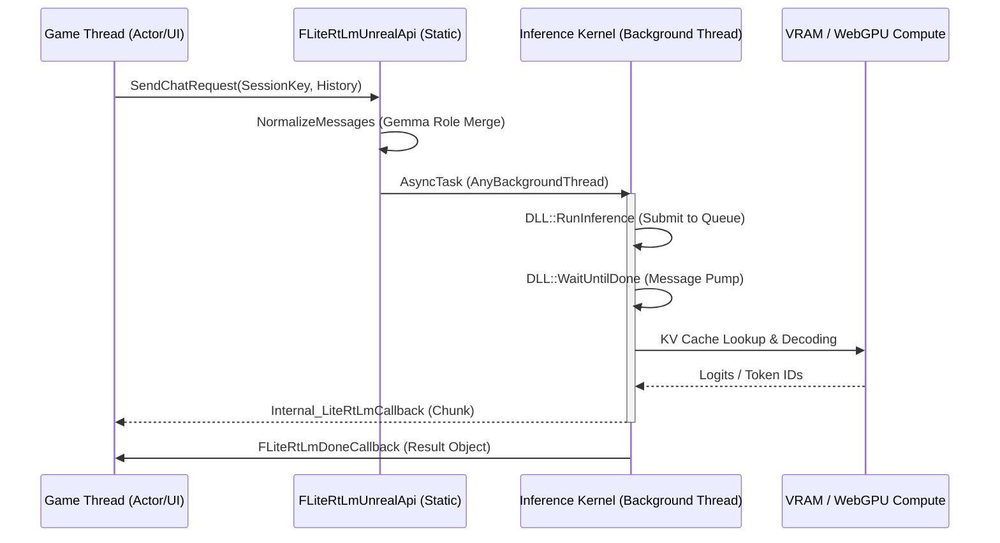

# LiteRT-LM Unreal: 5. 底层核心原理 (API Layer)

**版本:** 1.0.4  
**密级:** Winyunq 核心工程标准  
**状态:** 已发布

## 1. 架构愿景 (Architectural Vision)
LiteRT-LM API 层是连接虚幻引擎与 Google LiteRT-LM 推理内核的“硬桥接”。它采用了 **ABI 防火墙 (Firewall)** 设计，将复杂的外部依赖（Abseil, Protobuf）隔离在 `litert_lm_wrapper.dll` 之后，通过极简的 C-Style 接口保证了插件的“零链接”稳定性。

### 1.1 推理物理流 (Inference Physical Flow)


---

## 2. 符号分解 (Symbol Decomposition)

### 2.1 核心数据契约 (Core Structs)

#### `FLiteRtLmConfig` (引擎物理参数)
- **ModelPath**: `.litertlm` 或 `.bin` 权重的绝对路径。
- **Backend**: `gpu` (默认, Windows 下为 Vulkan) 或 `cpu`。
- **MaxNumTokens**: **物理内存界限**。KV Cache 的预分配大小。增加此值会直接导致 `LoadModel` 时显存占用上升。
- **bOptimizeShader**: Windows 平台推荐开启，通过预编译 Shader 减少推理初始延迟。

#### `FLiteRtLmResult` (推理产出物)
- **FullText**: 净化后的纯文本回复（已移除 `<start_of_turn>` 等特殊 Token）。
- **ToolCalls**: 结构化工具调用数组。系统会自动从 `full_json` 中解析并生成符合 OpenAI 规范的 `call_id`。
- **TokensPerSec**: 物理性能指标，用于评估当前硬件负载。

### 2.2 静态接口详述 (Static Interfaces)

#### `SendChatRequest` (核心推理入口)
```cpp
static void SendChatRequest(
    void* SessionKey,
    const TArray<TSharedPtr<FJsonObject>>& Messages,
    const FString& ToolsJson,
    FLiteRtLmChunkCallback OnChunk,
    FLiteRtLmDoneCallback OnDone,
    const FLiteRtLmSamplingParams& Params
);
```
- **物理行为**:
  1. **消息规范化**: 针对 Gemma 模型，自动将 `system` 角色合并至首个 `user` 消息；将 `tool` 结果转换为带上下文标识的 `user` 消息。
  2. **增量同步**: 系统内部维护 `LastSentCount`。若对话历史增加，仅向 DLL 发送 Delta 部分；若历史缩短，自动触发 Session 重置。
  3. **异步泵**: 在后台线程调用 `WaitUntilDone`，手动驱动 WebGPU 事件循环以触发流式回调。

---

## 3. 物理映射 (Physical Mapping)

### 3.1 瞬间会话映射 (Instant KV Cache Mapping)
- **SessionKey (`void*`)**: 插件将任意内存地址（通常是 Agent Actor 的指针）作为 Hash Key。
- **逻辑**: 切换不同 Agent 时，由于底层 KV Cache 已按指针锁定在显存中，**切换延迟 < 1ms**。这意味着在同一个关卡中，你可以让数百个 Agent 同时拥有独立“记忆”而无性能抖动。

### 3.2 显存分配策略 (VRAM Strategy)
- **动态探测**: `GetAutoConfig` 通过 **DXGI** 接口实时查询系统可用显存。
- **保守预算**: 默认封顶 4GB，若可用显存低于 2GB，系统会自动切换至 `cpu` 后端并将 `MaxNumTokens` 降至 1024，以防止 D3D 驱动崩溃。

---

## 4. 参数契约与副作用 (Contract & Side Effects)

### 4.1 内存与生命周期
- **`SessionKey` 有效性**: 虽然 `void*` 不需要 UObject 引用，但如果 SessionKey 指向的对象被销毁，必须手动调用 `ReleaseSession`，否则会导致显存泄露。
- **回调安全**: `OnChunk` 和 `OnDone` 保证在 **Game Thread** 执行。在回调内部修改 UI 或 Actor 是物理安全的。

### 4.2 线程副作用
- **非阻塞保证**: 推理循环 `WaitUntilDone` 运行在 `AnyBackgroundThreadNormalTask`。
- **CPU 抢占**: 在 `cpu` 后端模式下，大模型推理会占满 `NumThreads` 指定的核心，可能导致 UE 物理模拟频率略微下降。

---

## 5. 约束解码 (Constrained Decoding)
支持在 **Token 生成阶段** 进行硬约束（而非事后检查）：
- **Regex**: 强制输出符合正则（如：`^[0-9]+$`）。
- **JSON**: 强制输出有效 JSON 对象，自动补全缺失的括号。
- **Lark**: Winyunq 专有的代理指令集约束，确保 Agent 不会输出超出预设指令集的非法操作。

---
**Winyunq Industrial Documentation Standard**  
*硬件基准: 13900HX / RTX 4060 64G*  
*物理引擎: LiteRT v2.16.x*
