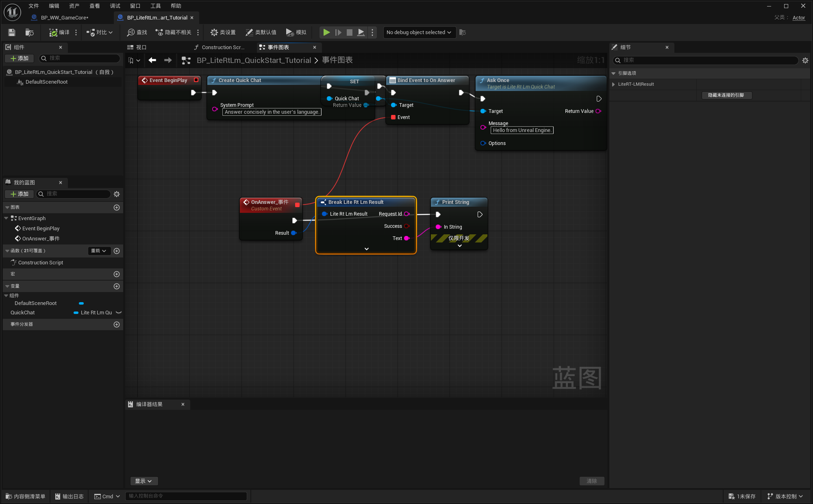

# LiteRT-LM Unreal documentation

Practical, scenario-first documentation for the LiteRT-LM Unreal plugin.

- [English overview](index.html)
- [5-minute Quick Chat tutorial](GUIDE_QUICK_START.html)
- [Multiple independent conversations](GUIDE_MULTIPLE_CONVERSATIONS.html)
- [Complete plugin system map](SYSTEMS.html)
- [C++ integration guide](GUIDE_CPP.html)

## 中文文档

- [插件总览](index_zh.html)
- [快速单对话教程](GUIDE_QUICK_START_zh.html)
- [多对话教程](GUIDE_MULTIPLE_CONVERSATIONS_zh.html)
- [完整插件体系图](SYSTEMS_zh.html)
- [C++ 接入指南](GUIDE_CPP_zh.html)

This branch contains documentation only. The tutorials explain the public Blueprint and C++ surfaces; implementation source is maintained separately.
